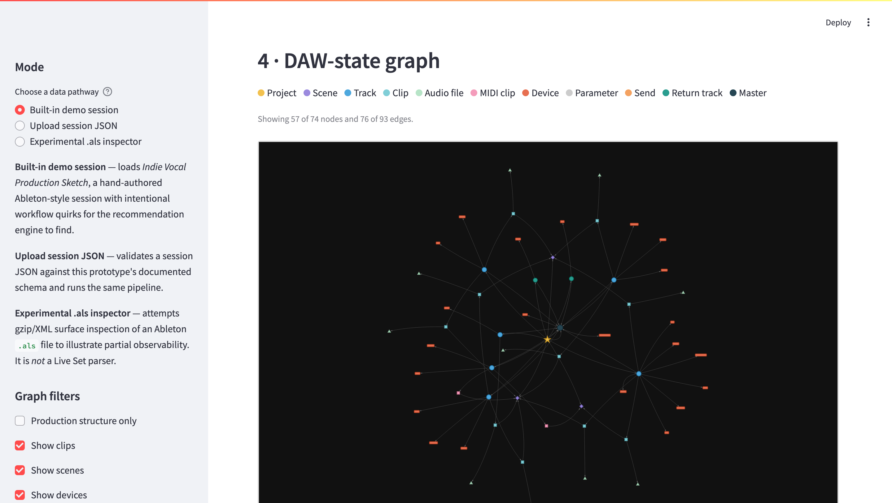
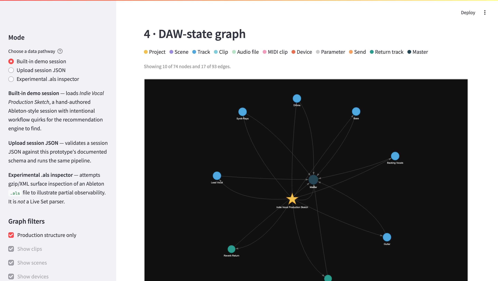

# Session State Explorer v0

[](https://github.com/colonelkernel/AbletonSessionStateExplorer/actions/workflows/tests.yml)
[](https://session-state-analyzer-n2lj2kmjjijdzta7oarpyt.streamlit.app/)

**Interpretable DAW-state graphs for human-centered AI-assisted music production.**

**[Live demo](https://session-state-analyzer-n2lj2kmjjijdzta7oarpyt.streamlit.app/)** — this adapter's canonical bundles rendered in the Session State Analyzer workbench (no install).

A research prototype built for a preliminary PhD application to the Music
Technology Group (Universitat Pompeu Fabra), in collaboration with Steinberg.
The session model is **DAW-agnostic by design** — this prototype instantiates
it in an Ableton-style dialect (built-in demo session), and
[docs/cubase_mapping.md](docs/cubase_mapping.md) records the direct mapping to
Cubase / VST3 concepts.

DAW sessions contain rich production knowledge — routing decisions, device
chains, clip/scene structure, gain staging — yet most AI music systems only
see audio, text, or isolated parameters. This prototype demonstrates that
Ableton-style session state can be represented as structured, typed data;
converted into an interpretable graph; linked to audio descriptors extracted
from stems or mixdowns; and used to generate *explainable* production
recommendations that preserve producer agency.

> **Scope statement.** This prototype does not attempt full Ableton Live Set
> reconstruction, proprietary session introspection, or autonomous mixing. It
> demonstrates how Ableton-style DAW-state elements can be represented,
> inspected, exported where supported, and used for explainable production
> assistance.



*Production-structure view (tracks, sends, returns, master only):*



*(All screenshots live in `docs/screenshots/` — session summary, graph views,
tables, explainable recommendations, and the experimental prediction section.)*

## What this prototype does

- Defines a **typed Ableton-style session model** (tracks, clips, scenes,
  devices, device parameters, sends, return tracks, master track) with pydantic.
- Converts session state into a **directed, typed DAW-state graph** (NetworkX)
  with node/edge types, per-node metadata, and graph-level statistics.
- Ships a built-in demo session, **“Indie Vocal Production Sketch”**, with
  intentional workflow quirks for the recommendation engine to detect.
- Extracts **audio descriptors** from uploaded stems, loops, or mixdowns
  (librosa; optional pyloudnorm LUFS) and associates them with tracks/clips.
- Generates **rule-based, explainable recommendations** — each with an
  explanation, a suggested action, an explicit caveat, a confidence value, and
  the graph nodes it reasons about.
- Renders an **interactive graph visualization** (PyVis, Plotly fallback) with
  node-type filters and per-track focus.
- Exports session state, graph, descriptors, and recommendations as
  **transparent JSON**, individually or as a complete bundle.
- Optionally attempts an **Ableton-compatible export** via a clean adapter
  with graceful fallback to a documented mock export.
- Includes **experimental surface inspectors** for Ableton `.als` files
  (gzip/XML) and Cubase Track Archive `.xml` files (class-attribute counting)
  to illustrate partial observability — explicitly *not* a Live Set parser.
- Bridges to **real Ableton Live sessions** via a bundled Live extension
  built on the public Extensions SDK — export any open Set as schema JSON
  from inside Live, upload it, and run the full pipeline on it. Verified
  end-to-end in Live 12.4.5 beta on a real Set (screenshots `09`–`11` in
  `docs/screenshots/`).
- Ships **two built-in demo dialects**: the Ableton-style *Indie Vocal
  Production Sketch* (session grid, intentional workflow quirks) and the
  Cubase-style *Alt-Pop Mix Bus* (linear arranger, wired FX-channel sends,
  dialect-supplied device families such as REVerence and Magneto II) — the
  same model, the same pipeline, two DAW paradigms.
- Computes a **session diff** between two versions of a session — devices,
  sends, returns, tempo, graph-size deltas — with a human-readable narrative.
  The built-in *Revision 2* enacts the demo's recommendations, closing the
  loop: recommendation → action → verifiable state change.
- Computes a **session fingerprint** and structural similarity between two
  session JSON files.
- Includes a **learned DAW-state prediction baseline** (experimental): masked
  device-family prediction trained on a seeded synthetic session corpus, with
  predicted-but-absent chain stages surfaced as data-grounded suggestions.

## What this prototype does not do

- It does not parse `.als` files into the session model.
- It does not fabricate `.als` files (no supported public export path exists).
- It does not require Ableton Live to be installed, and uses no proprietary
  Ableton internals.
- It does not mix, master, or modify audio.
- The recommendation engine is a **heuristic prototype**, not an AI mixer; it
  never claims a session is "wrong."

## Installation

Requires Python 3.10+.

```bash
git clone <this-repo>
cd AbletonSessionStateExplorer
pip install -r requirements.txt
```

## Usage

```bash
streamlit run src/ableton_session_state_explorer/app.py
```

Headless CLI:

```bash
PYTHONPATH=src python -m ableton_session_state_explorer export-demo --out exports/demo
PYTHONPATH=src python -m ableton_session_state_explorer export-demo --dialect cubase
PYTHONPATH=src python -m ableton_session_state_explorer diff-demo
PYTHONPATH=src python -m ableton_session_state_explorer inspect-als path/to/set.als
PYTHONPATH=src python -m ableton_session_state_explorer inspect-track-archive path/to/tracks.xml
```

Tests:

```bash
python -m pytest
```

## Operating modes

1. **Built-in demo session** — loads *Indie Vocal Production Sketch*
   (6 tracks, 3 scenes, 12 clips, 22 devices, 2 return tracks, master chain).
   Fully self-contained; no audio or Ableton install needed.
2. **Session JSON upload** — validates your session against the documented
   schema (see [data/examples/example_session.json](data/examples/example_session.json))
   and runs the same graph → descriptors → recommendations pipeline.
3. **Experimental `.als` inspector** — cautious gzip/XML surface inspection of
   an uploaded Live Set: root tag, tag frequencies, counts of track-like /
   device-like / clip-like elements. Not a parser; never feeds the graph.
4. **Optional Ableton export** — the adapter probes for a public Live Set
   export library; when none is available (the normal case), it writes a
   transparent mock export (`project_state.json`, `session_graph.json`,
   `README_EXPORT_LIMITATIONS.md`).

## Graph schema overview

**Node types:** `project`, `scene`, `track`, `clip`, `midi_clip`,
`audio_file`, `device`, `parameter`, `send`, `return_track`, `master_track`.

**Edge types:** `contains_scene`, `contains_track`, `contains_clip`,
`clip_in_scene`, `uses_audio_file`, `has_device`, `has_parameter`, `sends_to`,
`routes_to_master`, `group_contains`, `has_return`, `has_master`.

Every node carries `id`, `label`, `type`, and relevant metadata (track role,
device family, clip length, etc.). Graph metadata includes track/clip/device/
parameter/send/return counts, graph density, and a count of uncertain or
placeholder elements — partial observability is represented, not hidden.

Sessions declare their DAW dialect via the `metadata.daw_dialect` convention
(`"ableton-style"`, `"cubase-style"`, or `"generic"`); see
[docs/cubase_mapping.md](docs/cubase_mapping.md) for the Cubase/VST3 reading
of each concept.

Export bundle shape:

```json
{
  "schema_version": "0.1.0",
  "project": { "...": "typed session state" },
  "graph": { "nodes": [], "edges": [], "metadata": {} },
  "descriptors": [],
  "recommendations": [],
  "warnings": [],
  "export_metadata": { "mode": "graph_only", "ableton_export_available": false }
}
```

## Recommendation examples

On the demo session, the engine produces (among others):

- **“Return tracks are defined but not used.”** — returns exist, no sends
  target them; flagged as a possible unfinished routing structure.
- **“Consider routing ambience through shared return tracks.”** — multiple
  tracks carry individual reverbs/echo while send routing is idle.
- **“Vocal track may benefit from a clearer corrective chain.”** — a
  vocal-like track shows no EQ/dynamics/de-essing stage.
- **“Dense device chain detected.”** — a track exceeds six devices.
- **“Master limiter detected without loudness context.”** — limiter on the
  master, but no mixdown descriptors to interpret it.
- **“Potential level imbalance detected.”** — one uploaded file's RMS is far
  above the session median (descriptor-driven).

Every recommendation uses non-prescriptive language ("Consider…", "This may
indicate…") and carries an explicit caveat. These are heuristics, not rules.

## Audio descriptor extraction

For each uploaded WAV / AIFF / FLAC / MP3 (backend permitting): duration,
sample rate, RMS mean/std, peak amplitude, spectral centroid / bandwidth /
rolloff means, zero-crossing rate, onset strength, estimated tempo, a
crest-factor dynamic-range approximation, and — if `pyloudnorm` is installed —
integrated loudness (LUFS). When **Essentia** is installed, two extra
descriptors are computed per file (spectral complexity mean and
danceability); Essentia is exercised when present but never required.

## DAW-state prediction (experimental)

Section 9 of the app demonstrates the *prediction* pathway of the research
framing with an honest, small-scale baseline
([prediction.py](src/ableton_session_state_explorer/prediction.py)):

- A **seeded synthetic corpus** of sessions is generated from role-conditioned
  device-chain priors (the priors are the ground truth of the synthetic world;
  the model's job is to recover them from samples).
- An **interpretable conditional model** (role/type-conditioned family
  frequencies with pairwise co-occurrence lift — every score decomposes into
  named counts) is trained on 80% of the corpus and evaluated on the held-out
  20% at **masked device-family prediction**: hide one device, predict its
  family from the track's role, type, and remaining chain.
- Typical held-out results (seed 42): **hit@1 ≈ 0.62, hit@3 ≈ 0.95**, vs. a
  global-frequency baseline at hit@1 ≈ 0.55, hit@3 ≈ 0.86.
- Predicted-but-absent chain stages on the loaded session are surfaced as
  data-grounded suggestions in the same explainable format as the heuristic
  rules — and every one is caveated as **trained on synthetic data**: this is
  a proof-of-concept for DAW-state prediction, not real-world mixing
  knowledge.

## Real sessions via the Ableton Extensions SDK

The repo includes **Session State Exporter**
([extension/session-state-exporter](extension/session-state-exporter/README.md)),
a Live extension built on Ableton's public Extensions SDK (vendored in
`extensions-sdk-1.0.0-beta.0/`). Running inside Live 12.3+, it walks the
current Set through the official data model — tracks, session and
arrangement clips, device chains (recursing racks), parameters, active
sends, returns, main chain, scenes, tempo, scale — and writes JSON in this
app's schema. Load the file via **Upload session JSON** and the full
pipeline (graph, recommendations, diff, prediction) runs on a *real*
session.

The export is honest about partial observability: what API 1.0.0 does not
expose (track colors, device on/off, dB-calibrated mixer values, the Set
name) is recorded as absent, with raw observations preserved in
`raw_source`. Track roles and device families are backfilled by the
explorer's keyword classifiers on upload — they are research heuristics,
not DAW facts.

## Ableton export limitations

The SDK bridge above is **inbound** (Live → explorer). In the outbound
direction, the SDK does not provide offline Live Set authoring from Python,
and no official Live Set export package exists on PyPI. The adapter in
[ableton_export_adapter.py](src/ableton_session_state_explorer/ableton_export_adapter.py)
probes for candidate export modules so a future official package can be
adopted without code changes; until then it produces a documented mock export.
We deliberately do not hand-craft `.als` files — fabricating a proprietary
format would overstate compatibility.

## Relationship to the PhD proposal

The prototype operationalizes the proposal's core claim: DAW-state, treated as
a **partially observable typed graph**, is a viable substrate for
human-centered AI-assisted production research. It makes session structure
(tracks, routing, device chains) a first-class research object; links symbolic
session state to acoustic evidence via descriptors; and shows that
recommendations can be *explainable by construction* — each one cites the
graph nodes it reasons over and states its own limits. The `.als` inspector
and export adapter demonstrate honest engagement with the boundary between
public tooling and proprietary formats. See
[docs/research_context.md](docs/research_context.md).

## Roadmap

- Train the chain-prediction baseline on real session corpora (the current
  synthetic corpus is a benchmark harness, not production knowledge).
- Learned (rather than keyword) track-role and device-family classification.
- Automation and parameter-modulation edges in the graph.
- Graph-level ML: session-state embeddings, next-action prediction,
  counterfactual "what changed between versions" diffs.
- A Cubase Track Archive XML importer as the cautious `cubase-style` import
  surface (v0.1 ships a surface **inspector** for Track Archives, parallel to
  the `.als` inspector; importing into the graph pipeline is the next step
  per [docs/cubase_mapping.md](docs/cubase_mapping.md)).
- Adoption of an official Live Set export path if/when one becomes public.
- User studies on recommendation trust, explanation quality, and agency.
- Cross-DAW abstraction (the model is Ableton-style, not Ableton-bound).

## License

MIT — see [LICENSE](LICENSE).
